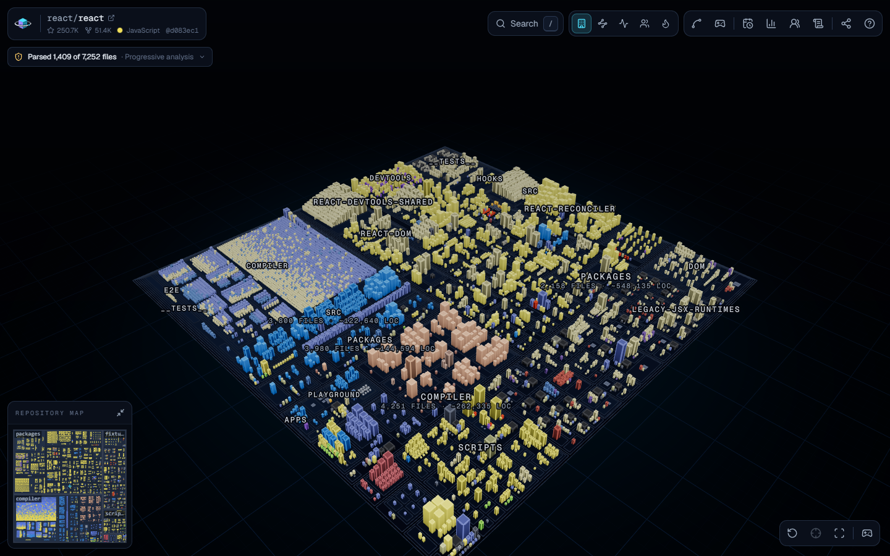
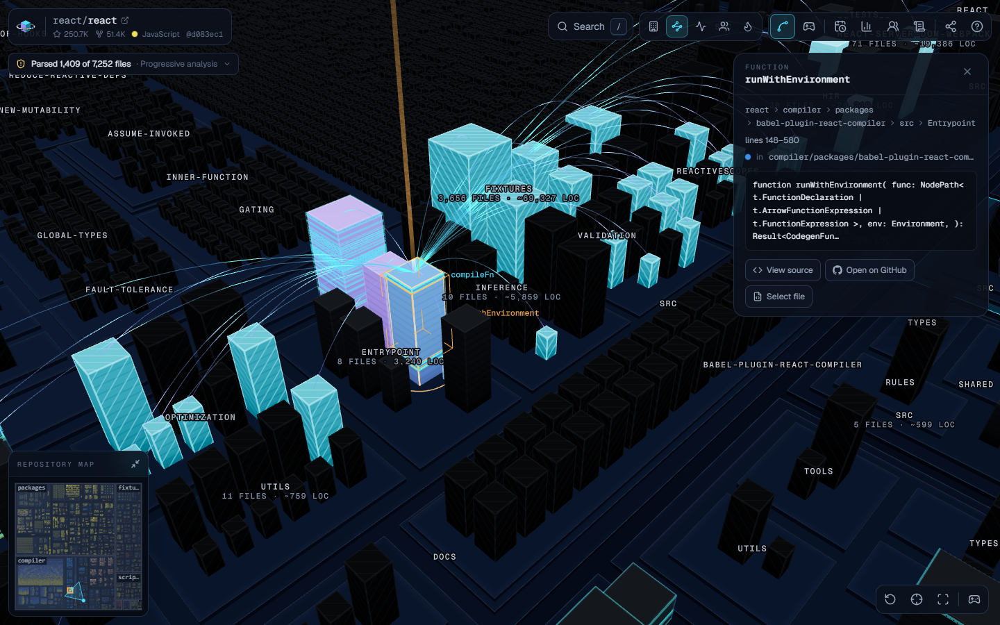
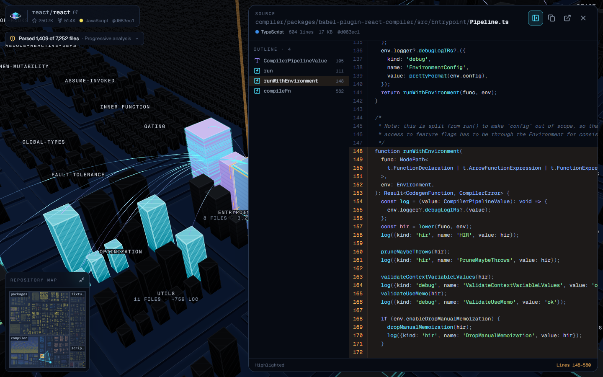
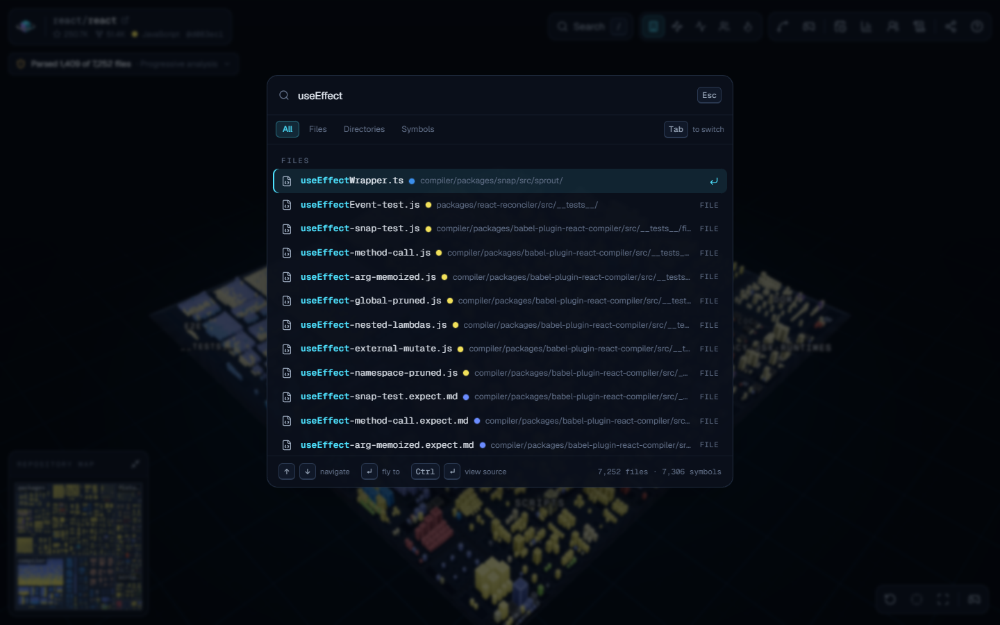
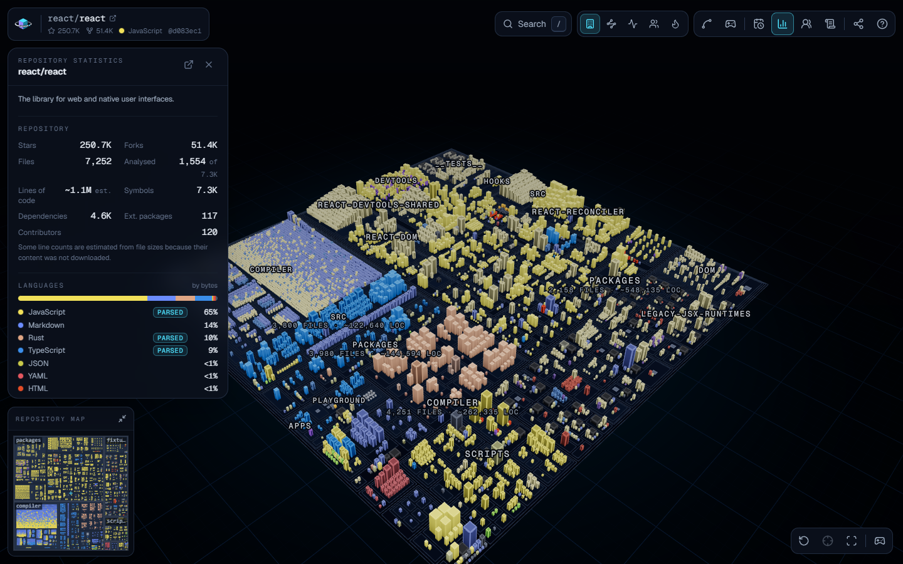
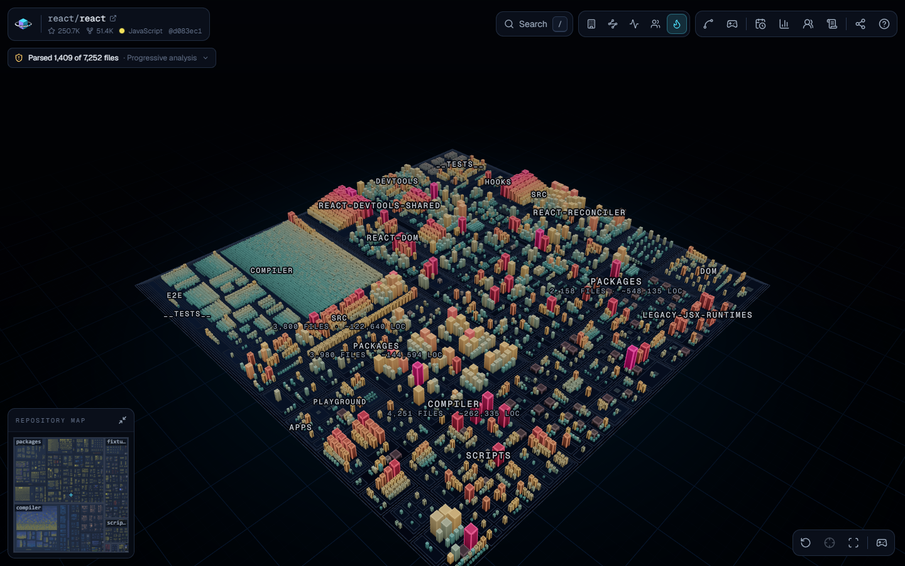
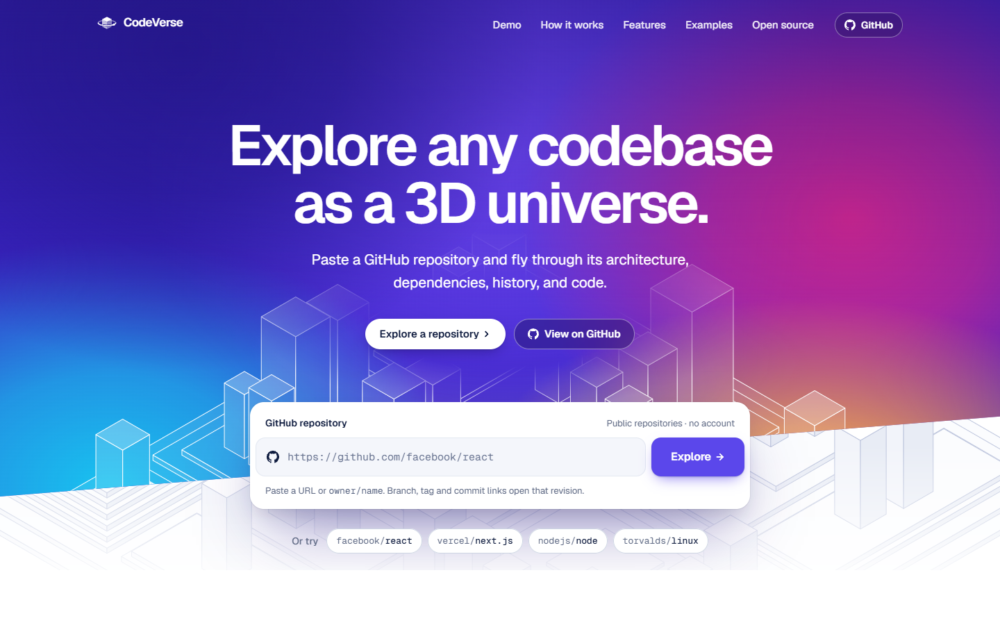
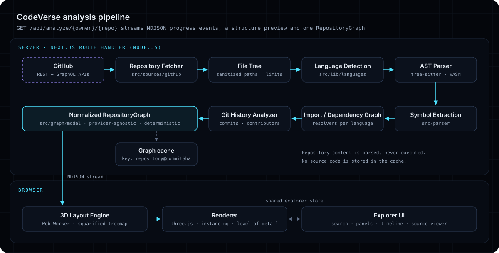
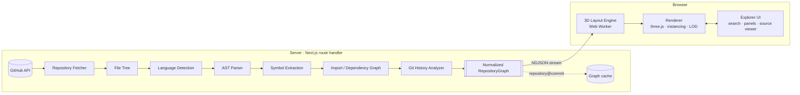

<p align="center">
  <picture>
    <source media="(prefers-color-scheme: dark)" srcset="public/brand/logo-dark.svg">
    
  </picture>
</p>

<h3 align="center">See your codebase from a different dimension.</h3>

<p align="center">
  CodeVerse turns any public GitHub repository into an explorable 3D universe: directories become districts,
  files become buildings, imports become arcs and commits light up the city.
</p>

<p align="center">
  <a href="https://github.com/tedddby/CodeVerse/actions/workflows/ci.yml"></a>
  <a href="LICENSE"></a>
  
</p>

<p align="center">
  <a href="https://codeverse.awab.tech"><strong>Try it live → codeverse.awab.tech</strong></a>
</p>

<p align="center">
  <a href="https://codeverse.awab.tech/explore/facebook/react">Explore facebook/react</a> ·
  <a href="#quick-start">Quick start</a> ·
  <a href="docs/ARCHITECTURE.md">Architecture</a> ·
  <a href="#deployment">Deploy</a> ·
  <a href="CONTRIBUTING.md">Contribute</a>
</p>

<!-- Media is captured from a running build; see docs/media/README.md for the shot list and how to recapture it. -->
<p align="center">
  
</p>

<table>
  <tr>
    <td width="50%"></td>
    <td width="50%"></td>
  </tr>
  <tr>
    <td></td>
    <td></td>
  </tr>
  <tr>
    <td></td>
    <td></td>
  </tr>
</table>

<p align="center"><sub>Real captures of <code>facebook/react</code> (which GitHub now serves as <code>react/react</code>), analyzed without a GitHub token. Not mock-ups.</sub></p>

## What it is

Paste a GitHub URL. CodeVerse reads the repository through the GitHub API, parses real syntax trees with
tree-sitter, resolves imports into a dependency graph, reads recent history, and renders the result as a
city you can fly through. Nothing is cloned, installed or executed.

## Features

- **Architecture districts** – directories become terraced districts; files become buildings sized by bytes
  and lines of code and colored by language.
- **Dependency arcs** – resolved imports arc between buildings. Select a file to see what it imports and what
  imports it.
- **Activity & history timeline** – scrub through recent commits and watch the files they touched light up.
- **Contributors** – highlight the parts of the codebase each contributor touched in the analyzed history.
- **Complexity** – large files with many symbols and dependencies stand out as hotspots.
- **Symbols as floors** – classes, functions and methods appear as bands on a building when you get close.
- **Search & source viewer** – fuzzy-find any file or symbol (`/`) and read syntax-highlighted source at the
  exact line, fetched on demand.
- **Shareable views** – links encode the revision, mode, selection and camera, so others land where you are.
- **Large-repository modes** – progressive and directory-first tiers keep tens of thousands of files
  responsive, and every omission is reported.
- **Keyboard first** – orbit and fly (WASD) camera modes, focus, enter/leave directories, modes `1`–`5`,
  shortcuts overlay on `?`.
- **Accessible fallbacks** – a text summary of the repository, reduced-motion support, and a clear message when
  WebGL is unavailable.

## Quick start

Requirements: Node.js 20.9+ (22 LTS recommended) and pnpm 11 (`corepack enable`).

```bash
git clone https://github.com/tedddby/CodeVerse.git
cd CodeVerse
pnpm install          # also copies the tree-sitter grammars into public/grammars
cp .env.example .env.local   # optional: add a GITHUB_TOKEN (see below)
pnpm dev              # http://localhost:3000
```

| Command                     | What it does                                                        |
| --------------------------- | ------------------------------------------------------------------- |
| `pnpm dev`                  | Development server (Turbopack)                                      |
| `pnpm build` / `pnpm start` | Production build / server                                           |
| `pnpm test`                 | Unit and component tests (Vitest)                                   |
| `pnpm test:e2e`             | End-to-end tests (Playwright; builds and starts the app first)      |
| `pnpm lint`                 | ESLint                                                              |
| `pnpm typecheck`            | TypeScript, strict                                                  |
| `pnpm check`                | Typecheck, lint and unit tests in one go                            |
| `pnpm grammars`             | Re-copy the tree-sitter WebAssembly grammars into `public/grammars` |

The first `pnpm test:e2e` run needs a browser: `pnpm exec playwright install chromium`.

## GitHub token

CodeVerse works without credentials, but a token makes it much better. It is read on the server only, sent
exclusively to `api.github.com`, redacted from every log line and never reaches the browser.

| Without a token                                          | With `GITHUB_TOKEN`                                                                                                  |
| -------------------------------------------------------- | -------------------------------------------------------------------------------------------------------------------- |
| 60 GitHub API requests per hour, shared by the server IP | 5,000 requests per hour                                                                                              |
| History from the latest 100 commits, 6 of them in detail | History from the latest 300 commits, 40 in detail, plus GraphQL per-file last-modified dates and exact commit counts |

Create a [fine-grained personal access token](https://github.com/settings/personal-access-tokens/new) with
**Public repositories (read-only)** access and no permissions, or a classic token with no scopes. Then set it
in `.env.local` (development) or your host's secret settings (production):

```bash
GITHUB_TOKEN=github_pat_...
```

## Configuration

Every variable is optional. Analysis limits are validated at startup; if any `CODEVERSE_*` limit is invalid,
all limits fall back to their defaults and a warning is logged.

| Variable                            | Default                                                                                                   | Purpose                                                                                                                               |
| ----------------------------------- | --------------------------------------------------------------------------------------------------------- | ------------------------------------------------------------------------------------------------------------------------------------- |
| `GITHUB_TOKEN`                      | –                                                                                                         | Server-side GitHub token: higher rate limits and GraphQL history (see above).                                                         |
| `NEXT_PUBLIC_SITE_URL`              | Vercel production domain, else `https://codeverse.awab.tech` (production) / `http://localhost:3000` (dev) | Public URL of the deployment, used for Open Graph images, canonical links and the sitemap. Set it when self-hosting.                  |
| `NEXT_PUBLIC_REPOSITORY_URL`        | `https://github.com/tedddby/CodeVerse`                                                                    | Where "View on GitHub" and documentation links point.                                                                                 |
| `NEXT_PUBLIC_LABEL_FONT_URL`        | `/fonts/GeistMono-Medium.ttf`                                                                             | Label font (`.ttf`/`.otf`/`.woff`); the default is self-hosted (see [Privacy](docs/PRIVACY.md)).                                      |
| `CODEVERSE_MAX_FILES`               | `25000`                                                                                                   | Maximum files kept as buildings. Beyond it, the most meaningful files per directory are kept.                                         |
| `CODEVERSE_MAX_PARSED_FILES`        | `1500`                                                                                                    | Maximum files downloaded and AST-parsed per analysis.                                                                                 |
| `CODEVERSE_MAX_FILE_BYTES`          | `524288` (512 KB)                                                                                         | Largest single file downloaded (hard ceiling 2 MB).                                                                                   |
| `CODEVERSE_MAX_TOTAL_BYTES`         | `41943040` (40 MB)                                                                                        | Total bytes downloaded per analysis.                                                                                                  |
| `CODEVERSE_MAX_PARSE_BYTES`         | `262144` (256 KB)                                                                                         | Larger files are counted but not parsed.                                                                                              |
| `CODEVERSE_PARSE_TIMEOUT_MS`        | `2000`                                                                                                    | Per-file parse timeout.                                                                                                               |
| `CODEVERSE_FETCH_CONCURRENCY`       | `16`                                                                                                      | Concurrent file downloads (max 64).                                                                                                   |
| `CODEVERSE_MAX_COMMITS`             | `300`                                                                                                     | Commits listed for history (max 5,000; at most 100 without a `GITHUB_TOKEN`).                                                         |
| `CODEVERSE_MAX_COMMIT_DETAILS`      | `40`                                                                                                      | Commits whose changed files are fetched (max 500, at most `MAX_COMMITS`; 6 without a token).                                          |
| `CODEVERSE_TIER_FULL_MAX`           | `1000`                                                                                                    | Up to this many files, everything eligible is parsed.                                                                                 |
| `CODEVERSE_TIER_PROGRESSIVE_MAX`    | `10000`                                                                                                   | Above this many files, directory-first mode is used.                                                                                  |
| `CODEVERSE_CACHE_MAX_MB`            | `256`                                                                                                     | In-memory cache budget for analyzed graphs.                                                                                           |
| `CODEVERSE_CACHE_DIR`               | –                                                                                                         | Directory for a persistent on-disk graph cache (e.g. `.codeverse-cache`). No source code is stored.                                   |
| `CODEVERSE_RATE_LIMIT_PER_MINUTE`   | `12`                                                                                                      | Analyses per client IP per minute; `0` disables the limiter.                                                                          |
| `CODEVERSE_TRUSTED_PROXY_HOPS`      | `1`                                                                                                       | Reverse proxies in front of the server that append to `X-Forwarded-For`; the client address is read that many entries from the right. |
| `CODEVERSE_CLIENT_IP_HEADER`        | –                                                                                                         | A header your platform overwrites with the client address (e.g. `x-real-ip`); takes precedence.                                       |
| `CODEVERSE_MAX_CONCURRENT_ANALYSES` | `4`                                                                                                       | Analyses running at the same time on one server instance.                                                                             |
| `CODEVERSE_LOG_LEVEL`               | `info`                                                                                                    | Structured log level: `debug`, `info`, `warn`, `error` or `silent`.                                                                   |
| `CODEVERSE_METRICS`                 | `log`                                                                                                     | Metrics sink: `log` (debug-level log lines), `info` or `off`.                                                                         |
| `CODEVERSE_GRAMMAR_DIR`             | –                                                                                                         | Directory with the tree-sitter `.wasm` files (defaults to `public/grammars`, then `node_modules`).                                    |
| `NEXT_OUTPUT`                       | –                                                                                                         | Set to `standalone` at build time for the Docker image.                                                                               |

## Architecture

<p align="center">
  
</p>



1. **Ingestion** (`src/sources`, `src/github`) talks to GitHub through a provider interface
   (`RepositorySource`), validates every response with Zod and never follows user-supplied hosts.
2. **Parsing** (`src/parser`) runs tree-sitter grammars compiled to WebAssembly with per-file timeouts and byte
   caps, extracting symbols, imports and exports.
3. **Graph building** (`src/graph/builders`) selects files within the limits, resolves imports per language,
   folds in history and assembles a deterministic, provider-agnostic `RepositoryGraph`
   ([model](src/graph/model/types.ts)).
4. **Streaming** – `GET /api/analyze/{owner}/{repo}` reports progress as NDJSON events
   ([protocol](src/analysis/protocol.ts)), sends a structure preview early and the complete graph last.
5. **Layout & rendering** (`src/engine`) – a Web Worker computes a deterministic squarified-treemap city; the
   renderer draws it with instanced meshes, spatial chunks and level of detail.

Read [docs/ARCHITECTURE.md](docs/ARCHITECTURE.md) for module boundaries, the data model, caching, the layout
algorithm and how to add a language or a source provider.

## Project structure

```text
src/
├── app/                  Next.js App Router: landing page, /explore/[owner]/[repo], API routes, metadata
├── analysis/             Shared wire contracts: NDJSON analysis events, source viewer API
├── sources/              RepositorySource interface + GitHub provider (and an in-memory provider for tests)
├── github/               GitHub HTTP client: validation, rate limits, retries, ETags
├── parser/               tree-sitter runtime, grammar loaders and per-language extractors
├── graph/                RepositoryGraph model, id helpers, index, builders and graph algorithms
├── engine/               Layout (treemap city), camera, level of detail and three.js rendering
├── workers/              Web Worker entry points (layout)
├── state/                Zustand explorer store: the only channel between UI and canvas
├── components/           Explorer shell, panels, search, timeline, code viewer, landing page, UI kit
├── lib/                  Config and limits, caching, observability, search, share links, utilities
├── fixtures/             Demo repository and synthetic graphs (tests, landing demo, local rendering)
└── config/site.ts        Product name, URLs and example repositories
e2e/                      Playwright end-to-end tests
docs/                     Architecture, privacy, media shot list
scripts/sync-grammars.mjs Copies tree-sitter WebAssembly grammars into public/grammars
```

## Supported languages

Six languages are parsed into real syntax trees. Every other file is still detected (60 languages are
recognized), sized, colored and counted; it simply has no symbols or resolved imports.

| Language   | Extensions                 | Symbols extracted                                                            | Imports resolved through                                                |
| ---------- | -------------------------- | ---------------------------------------------------------------------------- | ----------------------------------------------------------------------- |
| TypeScript | `.ts` `.tsx` `.mts` `.cts` | functions, classes, methods, interfaces, types, enums, namespaces, constants | relative paths, `tsconfig` paths/baseUrl, package `imports`, workspaces |
| JavaScript | `.js` `.jsx` `.mjs` `.cjs` | functions, classes, methods, variables                                       | ES modules, `require()`, dynamic `import()`, `jsconfig`, workspaces     |
| Python     | `.py` `.pyi` `.pyw`        | functions, classes, methods, module constants                                | absolute and relative imports against detected source roots             |
| Java       | `.java`                    | classes, interfaces, enums, methods                                          | package + class names, Maven/Gradle source roots                        |
| Go         | `.go`                      | functions, methods, structs, interfaces, types, constants                    | `go.mod` module paths and `replace` directives                          |
| Rust       | `.rs`                      | functions, methods, structs, enums, traits, types, modules                   | Cargo crates, `mod` declarations, `use` paths                           |

## Large repositories

Analysis adapts to the size of the repository instead of failing:

| Tier              | Files (default)  | Behavior                                                                                                         |
| ----------------- | ---------------- | ---------------------------------------------------------------------------------------------------------------- |
| `full`            | up to 1,000      | Every eligible file is downloaded and parsed (within the byte limits).                                           |
| `progressive`     | 1,001 – 10,000   | A prioritized subset is parsed (hand-written source first); the rest is shown from tree metadata.                |
| `directory-first` | more than 10,000 | Structure first, a small sample parsed; at most 25,000 files become buildings, every directory keeps a presence. |

CodeVerse never pretends: each file carries an analysis status (`parsed`, `partial`, `content-only`,
`metadata-only`, `binary`, `failed`), estimated line counts are flagged as estimates, and the explorer shows a
coverage report with warnings such as a truncated GitHub tree, parse limits or rate limits.

## Limitations

- **Public GitHub repositories only.** GitLab, local folders and archives are on the roadmap.
- **History is recent, not complete.** With a token, the latest 300 commits are listed, 40 are inspected in
  detail, and per-file last-modified dates and exact commit counts are added. Without one, history is kept to a
  few requests to spare GitHub's 60-requests-per-hour quota: 100 commits are listed and only 6 inspected, so
  Activity mode, "Last modified" and contributor highlights cover few files. Raising `CODEVERSE_MAX_COMMITS` or
  `CODEVERSE_MAX_COMMIT_DETAILS` does not lift this cap; adding a token does. Either way, history shrinks
  further when little API quota is left.
- **Import resolution is static and best effort.** Build-time aliases, generated code and dynamic module loading
  that cannot be read from configuration files stay unresolved (and are counted as such).
- **Very large repositories are sampled.** GitHub truncates tree listings above roughly 100,000 entries, and the
  analysis limits bound downloads; the coverage report says exactly what was left out.
- **WebGL is required for the 3D view.** Without it the explorer offers a text summary of the repository.

## Privacy and security

- **Nothing is executed.** Repository content is parsed as data by sandboxed WebAssembly parsers; no build
  scripts, package managers or code from the repository ever run.
- **No source code is stored.** Cached graphs (keyed by `repository@commit`) contain structure and metadata:
  paths, sizes, symbol names and one-line signatures, imports, commit summaries and contributor names.
- **No accounts, analytics or tracking.** The token stays on the server; logs redact secrets.
- **Strict boundaries.** Only `github.com` repositories are accepted (no user-supplied hosts), all repository
  data is rendered as text, and a Content Security Policy is sent with every page.

Details: [docs/PRIVACY.md](docs/PRIVACY.md) and [SECURITY.md](SECURITY.md) (including how to report a vulnerability).

## Deployment

### Vercel

1. Import the repository in Vercel (framework preset: Next.js, install command `pnpm install`).
2. Add `GITHUB_TOKEN` as an environment variable. `NEXT_PUBLIC_SITE_URL` is optional on Vercel: it defaults to the project's production domain.
3. Deploy. The `postinstall` script copies the grammars; `next.config.ts` traces them into the API functions.

Analyses of large repositories can take a while: use a plan whose function duration allows at least 120 seconds.
The in-memory cache lives per function instance; for durable caching, prefer a long-running server (Docker).

### Docker

```bash
docker build -t codeverse .
docker run -p 3000:3000 \
  -e GITHUB_TOKEN=github_pat_... \
  -e NEXT_PUBLIC_SITE_URL=https://codeverse.example.com \
  -e CODEVERSE_CACHE_DIR=/app/.codeverse-cache \
  -v codeverse-cache:/app/.codeverse-cache \
  codeverse
```

The image is a multi-stage `node:22-alpine` build of the standalone server. It runs as a non-root user, listens
on port 3000 and reports health at `GET /api/health`. `NEXT_PUBLIC_*` values are inlined into client code at
build time, so pass them as build arguments too if they differ from the defaults
(`docker build --build-arg NEXT_PUBLIC_SITE_URL=... .`).

## Roadmap

- More sources: GitLab, local folders and ZIP uploads (the `RepositorySource` interface is ready for them)
- Full historical reconstruction: replay how the city grew commit by commit
- "Explain this area": optional AI summaries of a district, grounded in the graph
- More languages: C, C++, C#, Kotlin, Swift, Ruby and PHP grammars
- Private repositories with user-provided tokens (never stored)
- Diff mode: compare two refs and see what moved
- VR / immersive navigation

## Contributing

Contributions are welcome, from typo fixes to new languages. Start with [CONTRIBUTING.md](CONTRIBUTING.md), and
please follow the [Code of Conduct](CODE_OF_CONDUCT.md).

## License

[MIT](LICENSE) © 2026 CodeVerse contributors. Not affiliated with GitHub.
